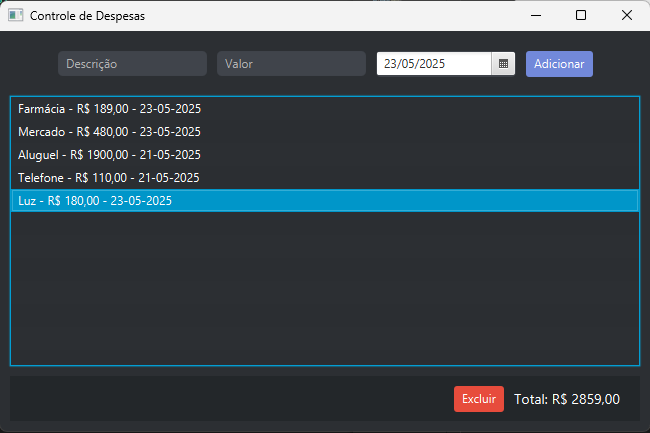

# Controle de Despesas - JavaFX

Projeto de aplicação desktop para controle simples de despesas, desenvolvido em Java com JavaFX e SQLite.

---



## Funcionalidades atuais

- **Cadastro de despesas** com:
  - Descrição
  - Valor (número decimal)
  - Data (selecionada via DatePicker, formato DD-MM-AAAA)

- **Listagem de despesas** em uma lista visual, exibindo descrição, valor e data.

- **Exclusão de despesas** selecionadas na lista.

- **Totalizador** que calcula a soma dos valores das despesas cadastradas.


---

## Tecnologias utilizadas

- Java 17 LTS
- JavaFX 21.0.7
- SQLite (via JDBC)
- Estrutura modularizada em MVC (Model, View, Controller)

---

## Requisitos

- Java 17 ou Superior

- JavaFX SDK 21.0.7

- SQLite JDBC driver (sqlite-jdbc-3.49.1.0.jar)

Coloque ambos em uma pasta lib/ dentro do diretório do projeto.

Compile com:
```bash
javac -encoding UTF-8 --module-path lib\javafx-sdk-21.0.7\lib --add-modules javafx.controls,javafx.fxml -cp lib\sqlite-jdbc.jar -d out @sources.txt
```

Rode com:
```bash
java --module-path lib\javafx-sdk-21.0.7\lib --add-modules javafx.controls,javafx.fxml -cp out;lib\sqlite-jdbc-3.49.1.0.jar app.Main
```

## Como usar

1. Execute a aplicação.
2. Insira descrição, valor e escolha a data.
3. Clique em "Adicionar" para salvar a despesa.
4. Visualize as despesas cadastradas na lista.
5. Selecione uma despesa e clique em "Excluir" para removê-la.

---

## Funcionalidades a serem implementadas

- **Filtro por data** para listar despesas entre datas específicas.
- **Categorias para despesas** (ex: Alimentação, Transporte, Lazer).
- **Relatórios e gráficos** para visualização mensal ou por categoria.
- **Exportação de dados** para CSV ou PDF.
- **Persistência avançada** com mais opções de banco (ex: MySQL, PostgreSQL).
- **Autenticação de usuário** para múltiplos perfis.
- **Backup e restauração** dos dados.
- **Notificações e alertas** para despesas recorrentes ou limite mensal.
- **Melhorias no design UI/UX**, incluindo ícones modernos e animações.
- **Temas escuro/claro**, incluindo um botão para que o usuário altere como preferir.
- **Criar executável** após implementar as melhorias.


---

**Desenvolvido por Jaysonstn**


